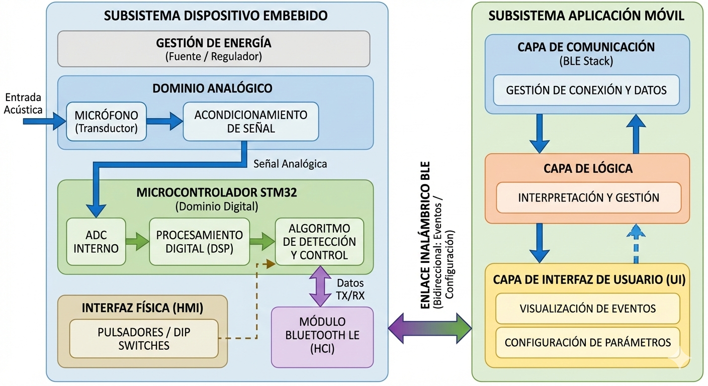
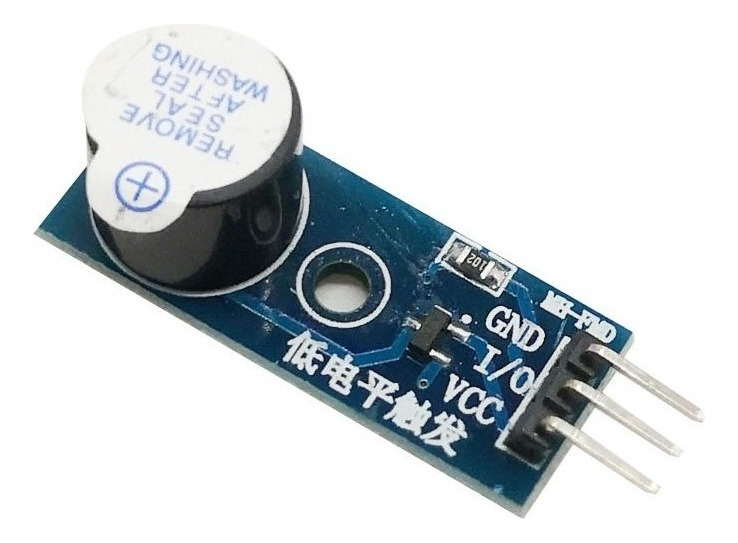
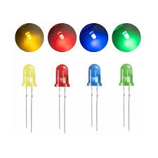

**UNIVERSIDAD DE BUENOS AIRES**  
**Facultad de Ingeniería**  
**TA134 Taller de Sistemas Embebidos**

Memoria del Trabajo Final:

***BeepBuddy* - Dispositivo de monitoreo acústico**

**Autores:**

**Sra. Emilia Cavalitto - 109394**

**Sra. María Teresa Diaz Tubiñez - 104838**

**Sr. Ulises Ferrero - 105034**

*Este trabajo fue realizado en la Ciudad Autónoma de Buenos Aires,*   
*entre Diciembre y Febrero de 2025 y 2026\.*

  
**RESUMEN**

En este trabajo se presenta el diseño e implementación de BeepBuddy, un sistema embebido destinado a la detección y notificación de eventos sonoros en tiempo real. El mismo fue concebido como una herramienta de asistencia para personas con discapacidad auditiva y como apoyo en el cuidado de personas, permitiendo alertar ante la presencia de sonidos relevantes del entorno. Su objetivo es ofrecer una solución portátil y configurable que facilite el monitoreo acústico en contextos cotidianos.

El sistema está compuesto por una plataforma de desarrollo provista por la cátedra de Taller de Sistemas Embebidos de la Facultad de Ingeniería de la Universidad de Buenos Aires que integra un microcontrolador con conversor analógico-digital, temporizadores y un módulo de comunicación Bluetooth de bajo consumo. El procesamiento de audio y la lógica de control fueron desarrollados en lenguaje C, mientras que la aplicación móvil utilizada para la configuración y recepción de notificaciones se implementó mediante la herramienta MIT App Inventor. El desarrollo del proyecto implicó la integración de hardware y software bajo criterios de diseño modular y uso eficiente de recursos.

En esta memoria se describen la motivación, la arquitectura del sistema, las decisiones de diseño adoptadas y las pruebas realizadas para validar su funcionamiento.

<strong>⚠ REVISAR ÚLTIMA ORACIÓN!! VER SI DESP EFECTIVAMENTE SE HABLA DE ESTO EN EL INFORME</strong>

**ABSTRACT**

This work presents the design and implementation of BeepBuddy, an embedded system for real-time detection and notification of acoustic events. The system is intended as an assistive solution for individuals with hearing impairments and as a support tool in caregiving scenarios, generating alerts when relevant environmental sounds are identified. The proposed device provides a portable and configurable platform for acoustic monitoring in everyday environments.

The system is based on a development board integrating a microcontroller with an analog-to-digital converter, hardware timers, and a low-energy Bluetooth communication module. Audio acquisition and control logic were implemented in the C programming language, while the mobile application for system configuration and notification reception was developed using MIT App Inventor. The project required the integration of hardware and software following modular design principles and efficient resource management typical of embedded systems. This document describes the system architecture, design methodology, implementation details, and validation results.

<strong>⚠ REVISAR ÚLTIMA ORACIÓN!! VER SI DESP EFECTIVAMENTE SE HABLA DE ESTO EN EL INFORME</strong>

# Índice General

- [**Registro de versiones**](#registro-de-versiones)
- [**Introducción general**](#introducción-general)
  - [1.1 Análisis de necesidad y objetivos](#11-análisis-de-necesidad-y-objetivos)
  - [1.2 Descripción general del sistema](#12-descripción-general-del-sistema)
- [**Introducción específica**](#introducción-específica) 
  - [2.1 Requisitos](#21-requisitos)
  - [2.2 Descripción de uso](#22-descripción-de-uso)
  - [2.3 Descripción de los módulos del sistema](#23-descripción-de-los-módulos-del-sistema)
    - [2.3.1 Alimentación](#231-alimentación)
    - [2.3.2 Microcontrolador](#232-microcontrolador)
    - [2.3.3 Módulo de micrófono](#233-módulo-de-micrófono)
    - [2.3.4 Módulo _Bluetooth_](#234-módulo-bluetooth)
    - [2.3.5 Módulo _buzzer_](#235-módulo-buzzer)
    - [2.3.6 Interfaz de usuario: _DIP switch_ y LEDs](#236-interfaz-de-usuario-dip-switch-y-leds)
  - [**Diseño e implementación**](#diseño-e-implementación)
    - [3.1 Diseño del _hardware_](#31-diseño-del-hardware)
    - 
- [**Bibliografía**](#bibliografía)

<strong>⚠ IR COMPLETANDO A MEDIDA QUE SE VAYAN ESCRIBIENDO CADA UNA DE LAS SECCIONES</strong>

## Registro de versiones

| Revisión | Cambios realizados | Fecha de finalización |
| :---: | ----- | ----- |
| 1.0 | Creación del documento | 10/02/2026 |
| 1.1 | Redacción del primer capítulo | 11/02/2026 |
| 1.2 | Redacción del segundo capítulo | 14/02/2026 |
| 1.3 | Redacción del tercer capítulo | ... |
| 1.4 | Redacción final | ... |

<strong>⚠ IR COMPLETANDO A MEDIDA QUE SE VAYAN ESCRIBIENDO CADA UNA DE LAS SECCIONES</strong>
 
### 

# **CAPÍTULO 1** 

# **Introducción general** 

## **1.1 Análisis de necesidad y objetivos** 

En los últimos años, el desarrollo de diferentes tecnologías ha permitido la creación de dispositivos dedicados a tareas específicas con mayor eficiencia, bajo consumo y mayor confiabilidad que otras opciones más generales. Sin embargo, en el ámbito del monitoreo sonoro aplicado al cuidado infantil o supervisión del entorno, muchas soluciones comerciales no contemplan las necesidades de personas con discapacidad auditiva.

Los monitores de bebé convencionales, por ejemplo, transmiten audio hacia un receptor portátil, pero requieren que el usuario pueda escuchar los sonidos detectados. Por otro lado, los monitores inteligentes con video suelen depender de conectividad Wi-Fi, servicios en la nube y aplicaciones complejas, lo que incrementa su costo como así también el consumo energético. Asimismo, las aplicaciones móviles de detección de sonido utilizan el micrófono del teléfono, lo que implica alto consumo de batería y baja confiabilidad.

En este contexto, surge la necesidad de desarrollar un dispositivo embebido dedicado, autónomo y configurable, capaz de detectar eventos sonoros relevantes y notificar de manera inmediata mediante comunicación Bluetooth, sin requerir conexión a internet. Así, el objetivo de este trabajo fue diseñar e implementar un sistema que permitiera asistir a personas con discapacidad auditiva en tareas de cuidado, particularmente en contextos donde la detección rápida de sonidos como llanto, alarmas o golpes resulta crítica. BeepBuddy se propuso como un producto mínimo viable que solventara cada una de estas características, priorizando confiabilidad, facilidad de uso y bajo consumo energético. A su vez, el valor agregado del proyecto radica en la posibilidad de configurar parámetros como sensibilidad y modos de operación, junto con la implementación de un menú interactivo accesible.

## **1.2 Descripción general del sistema**

BeepBuddy está compuesto por dos subsistemas principales: el dispositivo embebido de detección sonora y la aplicación móvil de notificación y configuración.
El primero integra un micrófono para la captación de señales acústicas, el microcontrolador con conversor analógico-digital para la digitalización de la señal, temporizadores para el control del muestreo y un módulo de comunicación Bluetooth para el envío de alertas. Asimismo, cuenta con una interfaz física básica compuesta por botones de configuración y un indicador luminoso de estado.
La aplicación móvil fue desarrollada utilizando la herramienta MIT App Inventor, permitiendo la visualización de alertas, consulta de historial y verificación del estado de conexión [1].

En la Figura 1.2.1 se presenta el diagrama en bloques general del sistema, donde se observan los principales módulos y su interconexión.

**Figura 1.2.1**: Diagrama en bloques general de BeepBuddy.

El funcionamiento general del dispositivo puede resumirse de la siguiente manera: el micrófono capta continuamente los sonidos del entorno y el microcontrolador digitaliza la señal mediante el conversor analógico-digital a una frecuencia de muestreo controlada por temporizadores internos. Las muestras adquiridas son procesadas en tiempo real para determinar si el sonido detectado cumple con los criterios configurados de sensibilidad o corresponde a un evento relevante previamente definido. En caso de detectarse una condición válida, el sistema genera una alerta y la transmite mediante el módulo Bluetooth al dispositivo móvil emparejado. La aplicación recibe la notificación, la muestra de forma visual al usuario y la registra en el historial de eventos. En ausencia de eventos significativos, el sistema continúa monitoreando el entorno de manera autónoma y con bajo consumo energético.

En las próximas secciones se describirá con mayor detalle los módulos utilizados y sus características.

# **CAPÍTULO 2**

# **Introducción específica** 

## **2.1 Requisitos**

Habiendo analizado las características principales del monitor, se definieron los principales requisitos para que el sistema cumpla con su función de forma correcta y resulte útil para su propósito. Para esto, se realizó una tabla definiendo los principales requisitos a implementar, mostrado en la Tabla 2.1.1.

**Tabla 2.1.1**: Requisitos del proyecto.

<table>
<thead>
<tr>
<th>Grupo</th>
<th>ID</th>
<th>Descripción</th>
</tr>
</thead>

<tbody>

<tr>
<td>Adquisición</td>
<td>1.1</td>
<td>El sistema cuenta con un micrófono para captar sonidos del entorno.</td>
</tr>
<tr>
<td></td>
<td>1.2</td>
<td>El sistema digitaliza la señal sonora mediante el ADC de la placa STM.</td>
</tr>

<tr>
<td>Procesamiento</td>
<td>2.1</td>
<td>El sistema detectar sonido relevantes (llanto, alarma, golpes, palabra clave).</td>
</tr>
<tr>
<td></td>
<td>2.2</td>
<td>El usuario puede configurar sensibilidad y parámetros mediante la interfaz de la aplicación.</td>
</tr>
<tr>
<td></td>
<td>2.3</td>
<td>El sistema almacena parámetros configurables en memoria junto con un historial de alertas.</td>
</tr>

<tr>
<td>Notificación</td>
<td>3.1</td>
<td>El sistema envía notificaciones a un dispositivo móvil vía Bluetooth .</td>
</tr>
<tr>
<td></td>
<td>3.2</td>
<td>Las notificaciones son inmediatas ante detección de eventos críticos.</td>
</tr>

<tr>
<td>Aplicación</td>
<td>4.1</td>
<td>La aplicación muestra alertas visuales asociadas a los sonidos detectados.</td>
</tr>
<tr>
<td></td>
<td>4.2</td>
<td>La aplicación permite consultar el historial de alertas.</td>
</tr>
<tr>
<td></td>
<td>4.3</td>
<td>La aplicación indica el estado de conexión Bluetooth del dispositivo.</td>
</tr>

<tr>
<td>Interfaz física</td>
<td>5.1</td>
<td>El sistema cuenta con botones y switches para seleccionar modo de operación.</td>
</tr>
<tr>
<td></td>
<td>5.2</td>
<td>El sistema cuenta con indicadores LEDs básicos de funcionamiento (encendido/apagado, modo y estado de conexión Bluetooth).</td>
</tr>

<tr>
<td>Requisitos de operación</td>
<td>6.1</td>
<td>El dispositivo funciona sin conexión a internet.</td>
</tr>
<tr>
<td></td>
<td>6.2</td>
<td>El sistema tiene bajo consumo energético.</td>
</tr>
<tr>
<td></td>
<td>6.3</td>
<td>El sistema es seguro y confiable, priorizando evitar omitir eventos reales.</td>
</tr>

</tbody>
</table>

## **2.2 Descripción de uso**

**Tabla 2.2.1**: Descripción de uso.

| Elemento | Definición |
| :---- | :---- |
| Disparador | Se produce un sonido en el entorno que supera el umbral de sensibilidad configurado. |
| Precondiciones | El sistema se encuentra encendido. El dispositivo está correctamente alimentado. El módulo Bluetooth se encuentra emparejado con la aplicación móvil. Los parámetros de sensibilidad están configurados.  |
| Flujo principal | El micrófono capta el sonido del entorno y lo convierte en una señal eléctrica analógica. El microcontrolador digitaliza la señal mediante el conversor analógico-digital y procesa las muestras adquiridas en tiempo real. Si el nivel del sonido supera el umbral configurado, el algoritmo de detección valida el evento como relevante. El microcontrolador envía una notificación a través del módulo Bluetooth al dispositivo móvil. La aplicación recibe el evento, lo muestra en pantalla y genera una alerta visual para el usuario. |
| Flujos alternativos | a. El sonido detectado no supera el umbral configurado. El sistema continúa monitoreando sin generar notificación. b. El módulo Bluetooth no se encuentra conectado al dispositivo móvil. El evento puede registrarse localmente, pero no se envía notificación. c. El usuario modifica los parámetros de sensibilidad desde la aplicación. El sistema actualiza la configuración y continúa operando con los nuevos valores. |

## **2.3 Descripción de los módulos del sistema**
## **2.3.1 Alimentación**
La alimentación de BeepBuddy se realizó mediante la placa de desarrollo NUCLEO-F103RB, la cual se conectó a una computadora portátil a través de un cable _USB Type A Type mini B_ \[2\].

El puerto _USB_ proporcionó una tensión nominal de 5 V _DC_. La placa NUCLEO incorpora reguladores de tensión internos que generan 3,3 V para el microcontrolador y permiten disponer de líneas de 5 V y 3,3 V para la alimentación de dispositivos externos (como se muestra en la Figura 2.3.1.1), tales como el _buzzer_ y el módulo _Bluetooth BLE_, ambos conectados a 3,3 V.

**Figura 2.3.1.1**: Referencia de diseño de la placa NUCLEO-F103RB tomada de las guías de trabajo de la cátedra \[3\].

Por otro lado, el módulo del micrófono se alimentó directamente desde el pin de 5 V provisto por la placa, compartiendo masa común con el resto del sistema.

Cabe destacar que esta configuración resultó adecuada para la etapa de prototipo (_MVP_). En una versión autónoma futura del dispositivo sería necesario incorporar una fuente regulada independiente.

## **2.3.2 Microcontrolador**
Como microcontrolador del sistema se utilizó la placa NUCLEO-F103RB conectada a la computadora portátil a través de un cable _USB Type A Type mini B_. La elección de la misma recayó exclusivamente en que fue la propuesta por la cátedra de la asignatura y fue con la que se trabajó a lo largo del ciclo lectivo. La placa se programó en C a través de la aplicación *STM32CubeIDE 1.19.0* y se muestra en la Figura 2.3.2.1 \[4\].

**Figura 2.3.2.1**: Placa NUCLEO-F103RB.

## **2.3.3 Módulo de micrófono**
Para la detección acústica se utilizó un módulo sensor de sonido con micrófono regulable Arduino Nubbeo del tipo KY-037 como se observa en la Figura 2.3.3.1 \[5\].

**Figura 2.3.3.1**: Módulo de micrófono.

El mismo, permite detectar la presencia de sonido ambiente y generar una salida digital cuando el nivel de sonido supera el umbral configurable a partir del potenciómetro incorporado en la placa (el cual se ajustó aproximadamente a la mitad del rango de operación del micrófono), y una salida analógica proporcional a la amplitud de la señal captada por el sensor.

El micrófono electret convierte la onda sonora en una señal eléctrica analógica de baja amplitud, la cual es amplificada por el circuito interno del módulo. Posteriormente, el comparador interno evalúa si la señal amplificada supera el umbral y, si esto ocurre, la salida digital cambia de estado y se enciende el LED indicador de detección. Por útlimo, la salida analógica entrega una señal proporcional a la amplitud del sonido captado, permitiendo su lectura mediante el conversor analógico-digital del microcontrolador.

## **2.3.4 Módulo _Bluetooth_**
Para la comunicación inalámbrica entre BeepBuddy y el dispositivo móvil receptor, se utilizó un módulo _Bluetooth_ compatible con _Bluetooth Low Energy (BLE)_ del tipo HM-10, como se observa en las Figuras 2.3.4.1 y 2.3.4.2 \[6\]\[7\].

**Figura 2.3.4.1**: Módulo _Bluetooth_ (vista superior).

**Figura 2.3.4.2**: Módulo _Bluetooth_ (vista inferior).

El módulo HM-10 es un adaptador inalámbrico que implementa la especificación _Bluetooth 4.0 BLE_, permitiendo la transmisión de datos en la banda _ISM_ de 2.4 GHz (_Industrial, Scientific and Medical_, rango de frecuencias de radio libre de licencia que cualquier dispositivo puede usar sin necesidad de permiso especial). Este módulo facilita el enlace inalámbrico entre el microcontrolador y el dispositivo móvil emparejado, posibilitando el envío de notificaciones y la configuración remota del sistema.

Desde el punto de vista funcional, el HM-10 dispone de una interfaz de comunicación serial _UART_ (_Universal Asynchronous Receiver/Transmitter_, el cual envía y recibe datos de a un bit a la vez, de forma secuencial) que permite intercambiar datos entre el microcontrolador y el módulo _Bluetooth_. Cuando el microcontrolador detecta un evento de sonido que cumple los criterios de detección configurados, transmite un paquete de datos a través de la interfaz _UART_ al módulo HM-10, el cual lo reenvía inalámbricamente al dispositivo móvil emparejado previamente.

## **2.3.5 Módulo _buzzer_**
En el dispositivo desarrollado, el _buzzer_ (observado en las Figuras 2.3.5.1 y 2.3.5.2) se implementó exclusivamente para emitir un breve pitido cuando el _switch_ principal pasa del estado _OFF_ a _ON_, indicando al usuario que el sistema ha sido energizado correctamente \[8\]\[9\].

**Figura 2.3.5.1:** Módulo _buzzer_ (vista superior).

**Figura 2.3.5.2:** Módulo _buzzer_ (vista inferior).

El mismo, está basado en un transductor piezoeléctrico, el cual produce sonido cuando se le aplica una señal eléctrica alterna que provoca la vibración mecánica de un diafragma cerámico.

Si bien el módulo fue comercializado como un _buzzer_ activo (es decir, con oscilador interno y capaz de funcionar al aplicarle una tensión continua), experimentalmente se verificó que no generaba sonido ante la aplicación de una señal continua. Por este motivo, fue necesario excitarlo mediante una señal cuadrada generada por el microcontrolador mediante modulación por ancho de pulso (_PWM_), suministrando así la señal alterna requerida para su funcionamiento.

## **2.3.6 Interfaz de usuario: _DIP switch_ y LEDs**
La interfaz de usuario del dispositivo está compuesta por un _DIP switch_ (_Dual In-line Package switch_) de tres posiciones y cuatro _LEDs_ (_Light Emitting Diodes_), los cuales permiten visualizar el estado de funcionamiento y el modo de operación seleccionado \[10\]. Los mismos se muestran a continuación en las Figuras 2.3.6.1 y 2.3.6.2.

**Figura 2.3.6.1:** _DIP switch_.

**Figura 2.3.6.2:** _LEDs_.

La primera posición del _switch_ corresponde al encendido general del sistema. Cuando se la coloca en posición _ON_, el dispositivo se energiza, se enciende el _LED_ verde y el _buzzer_ emite un breve pitido. En caso de que no se seleccione ningún modo de operación, también se enciende el _LED_ rojo, indicando estado por defecto (modo no definido).

La segunda posición del interruptor _DIP_ habilita el modo día, encendiéndose el _LED_ amarillo como indicador visual, mientras que, al colocarlo en la tercera posición, se activa el modo noche encendiéndose el _LED_ azul.

Los modos de operación (día/noche) solo pueden activarse cuando la primera posición (encendido general, inidicada con el _LED_ verde) se encuentra en estado _ON_. Si las tres posiciones del _switch_ se encuentran activadas simultáneamente, el sistema entra nuevamente en el estado de _default_, encendiéndose el _LED_ rojo.

<strong>⚠ HAY QUE PONER ALGO SOBRE LA FLASH INTERNA???</strong>

# **CAPÍTULO 3**

# **Diseño e implementación**

## **3.1 Diseño del _hardware_**

<strong>⚠ CONTINUAR DESDE ACÁ EL CAP. 3</strong>

# **Bibliografía** 
\[1\] MIT App Inventor. [Online]. Available: https://appinventor.mit.edu/

\[2\] Manual de usuario de la placa NUCLEO-F103RB. [Online]. Available: https://www.st.com/en/evaluation-tools/nucleo-f103rb.html

\[3\] Aula virtual de la cátedra TA134 TALLER DE SISTEMAS EMBEBIDOS. [Online]. Available: https://campusgrado.fi.uba.ar/course/view.php?id=1217

\[4\] STM32CubeIDE. Integrated Development Environment for STM32. [Online]. Available:https://www.st.com/en/development-tools/stm32cubeide.html

\[5\] Manual de usuario del módulo de micrófono. [Online]. Available: https://www.alldatasheet.com/datasheet-pdf/download/1284506/JOY-IT/KY037.html

\[6\] Módulo HM-10 bluetooth 4.0 BLE a UART. TodoMicro. [Online]. Available: https://www.todomicro.com.ar/comunicacion/637-modulo-hm-10-bluetooth-40-ble-a-uart.html?srsltid=AfmBOopp0r5laITQYUaryYYiX3FX0pVC3rmiN0xScYLpI9sgNRYFOCRr

\[7\] Manual de usuario del módulo _Bluetooth_. [Online]. Available: https://www.alldatasheet.com/datasheet-pdf/download/1179058/ETC1/HM-10.html

\[8\] Módulo Buzzer Activo 3.3v A 5v. [Online]. Available: https://www.mercadolibre.com.ar/modulo-buzzer-activo-33v-a-5v/p/MLA2048303554?pdp_filters=seller_id%3A302249631#polycard_client=recommendations_vip-seller_data_items-above&reco_backend=ranker-retsys-same-seller&reco_model=rk_entity_sameseller&reco_client=vip-seller_data_items-above&reco_item_pos=0&reco_backend_type=low_level&reco_id=4009794f-8183-4ec4-8aa5-5448369b409f&wid=MLA752290080&sid=recos

\[9\] Manual de usuario del módulo _buzzer_. [Online]. Available: https://www.alldatasheet.com/datasheet-pdf/pdf/169124/ETC2/EFM-236L.html

\[10\] Manual de usuario del _DIP switch_. [Online]. Available: https://www.alldatasheet.es/datasheet-pdf/view/2015587/AGELECTRONICA/DIP-3.html

\[.\] Google Gemini. [Online]. Available: https://gemini.google.com/app?hl=es_419

\[.\] Chat GPT. [Online]. Available: https://chatgpt.com
