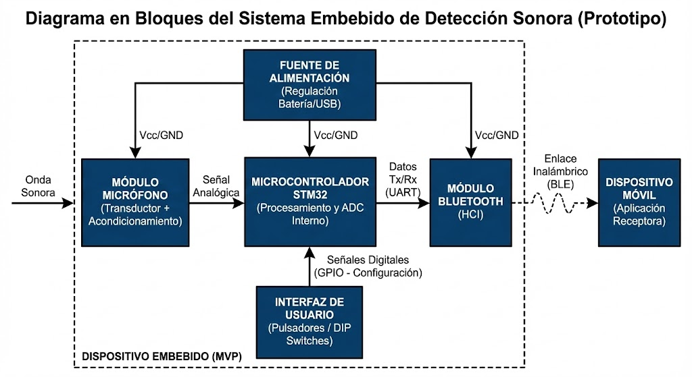

# **BeepBuddy**

**Autores:**
 - Cavalitto, Emilia - 109394
 - Diaz Tubiñez, María Teresa - 104838
 - Ferrero, Ulises - 105034

**Fecha: 2do cuatrimestre 2025**

### **1\. Selección del proyecto a implementar**

#### **1.1 Objetivo del proyecto y resultados esperados**

El objetivo de este proyecto es diseñar e implementar un MVP (Minimum Viable Product) de un sistema embebido de detección sonora con notificación vía Bluetooth a un dispositivo móvil, destinado a responsables con discapacidad auditiva que tengan bebés o niños pequeños. Adicionalmente, se busca desarrollar un menú interactivo para configurar sensibilidad, palabras clave y modos de operación. 

#### **1.2 Proyectos similares**

Entre los principales proyectos o productos comparables se encontraron:

1. Baby Monitors convencionales (audio), los cuales transmiten audio a un receptor portátil. Requieren que el usuario pueda escuchar los sonidos.

2. Monitores inteligentes con video (Wi-Fi), detectan movimiento o llanto mediante modelos básicos de reconocimiento, y envían notificaciones a una app. Suelen tener un costo elevado y requieren infraestructura Wi-Fi estable.
  
3. Aplicaciones móviles de detección de llanto, utilizan el micrófono del celular para detectar llanto. No son dispositivos dedicados, consumen mucha batería y presentan baja confiabilidad en ambientes ruidosos.

Para comparar estas alternativas, se consideran seis aspectos característicos:

1. Disponibilidad del hardware: Facilidad para adquirir los componentes físicos necesarios para implementar el proyecto.

2. Facilidad de uso: Se entiende como la simplicidad de instalación y empleo cotidiano.

3. Seguridad/Confiabilidad: Robustez del sistema ante falsas detecciones o fallos.

4. Tiempo de implementación: Dificultad técnica del desarrollo y tiempo que se necesitará para el diseño y cumplimiento de los objetivos esperados.

5. Costo: Costo global del sistema.

6. Interés personal: Grado de motivación del equipo para desarrollar el proyecto.

Se decide ponderar los aspectos con los siguientes pesos (1–10), siendo 1 el mínimo y 10 el máximo de nivel de importancia:

Disponibilidad del hardware: 10 (el prototipo debe poder construirse con componentes accesibles nacionales; la falta de disponibilidad impacta fuertemente en tiempo y costo del mismo).

Facilidad de uso: 9 (dado que el sistema está dirigido a responsables de cuidado debe ser sencillo e intuitivo en el uso diario, con el objetivo de facilitar el día a día de la persona en cuestión).

Seguridad / Confiabilidad: 9 (la seguridad es clave porque el sistema se usa en contextos de cuidado. Si bien las falsas alarmas no son deseables, es mucho más crítico evitar que el sistema falle en detectar un evento real).

Tiempo de implementación: 6 (siendo consistentes con la fecha de entrega).

Costo: 6 (se considera importante que éste no sea elevado pero se prioriza la confiabilidad y facilidad de uso del dispositivo).

Interés personal: 10 (se asigna el valor máximo porque el equipo está altamente motivado en abordar esta problemática y aportar a una solución que mejore la inclusión en un aspecto tan importante como el cuidado de otra persona).

A continuación, en la Tabla 1.2.1, se muestran los valores ponderados asignados a cada proyecto considerado anteriormente:

<table>
<thead>
<tr>
<th rowspan="2">Proyecto</th>
<th colspan="2">Baby monitor audio</th>
<th colspan="2">Smart video monitor (Wi-Fi)</th>
<th colspan="2">App móvil detección</th>
</tr>
<tr>
<th>Puntaje</th>
<th>Puntaje ponderado</th>
<th>Puntaje</th>
<th>Puntaje ponderado</th>
<th>Puntaje</th>
<th>Puntaje ponderado</th>
</tr>
</thead>

<tbody>

<tr>
<td align="center">Disponibilidad de hardware  (peso : 10)</td>
<td align="center">10</td>
<td align="center">100</td>
<td align="center">6</td>
<td align="center">60</td>
<td align="center">10</td>
<td align="center">100</td>
</tr>

<tr>
<td align="center">Facilidad de uso  (peso : 9)</td>
<td align="center">9</td>
<td align="center">81</td>
<td align="center">7</td>
<td align="center">63</td>
<td align="center">8</td>
<td align="center">72</td>
</tr>

<tr>
<td align="center">Seguridad / Confiabilidad  (peso : 9)</td>
<td align="center">4</td>
<td align="center">36</td>
<td align="center">7</td>
<td align="center">63</td>
<td align="center">5</td>
<td align="center">45</td>
</tr>

<tr>
<td align="center">Tiempo de implementación  (peso : 6)</td>
<td align="center">9</td>
<td align="center">54</td>
<td align="center">5</td>
<td align="center">30</td>
<td align="center">8</td>
<td align="center">48</td>
</tr>

<tr>
<td align="center">Costo  (peso : 6)</td>
<td align="center">8</td>
<td align="center">48</td>
<td align="center">3</td>
<td align="center">18</td>
<td align="center">10</td>
<td align="center">60</td>
</tr>

<tr>
<td align="center">Interés personal  (peso : 10)</td>
<td align="center">7</td>
<td align="center">70</td>
<td align="center">6</td>
<td align="center">60</td>
<td align="center">8</td>
<td align="center">80</td>
</tr>

<tr style="font-weight:700; background:#e6ffe6;">
<td align="center">Puntaje Total</td>
<td>-</td>
<td align="center">389</td>
<td>-</td>
<td align="center">234</td>
<td>-</td>
<td align="center">405</td>
</tr>

</tbody>
</table>

<em>Tabla: Comparación ponderada de alternativas</em>

#### **1.3 Selección de proyecto**

Considerando la Tabla 1.2.1, se elige implementar un sistema de detección sonora embebido con notificación vía Bluetooth .
Si bien existen alternativas como los monitores de bebé convencionales o los smart monitors con video, ambos presentan limitaciones importantes frente a los objetivos planteados.

Los baby monitors de audio, aún siendo económicos y accesibles, dependen completamente de que el usuario pueda oír, por lo que no resultan adecuados para personas con discapacidad auditiva. Además, no permiten personalizar sensibilidad ni detectar sonidos específicos más allá del volumen general.

Los monitores inteligentes con video poseen funciones más avanzadas, pero requieren conectividad Wi-Fi estable, tienen un costo elevado, y su procesamiento suele depender de servicios externos. Esto implica riesgos de privacidad, mayor complejidad técnica y un tiempo de implementación incompatible con el alcance del proyecto.

Las aplicaciones móviles de detección de llanto tampoco resultan óptimas: no son dispositivos dedicados, consumen mucha batería, dependen del micrófono del teléfono y son poco confiables en entornos ruidosos, además de interferir con el uso normal del celular.

Teniendo en cuenta estas limitaciones y los puntajes ponderados, el proyecto seleccionado es un dispositivo embebido dedicado a la detección sonora, con capacidad de identificar eventos relevantes y enviar notificaciones Bluetooth a un dispositivo móvil.
Este enfoque ofrece la mejor combinación de accesibilidad, confiabilidad, facilidad de uso e interés personal, al mismo tiempo que permite un desarrollo realista dentro del tiempo propuesto.

En Argentina, existe una demanda creciente de soluciones inclusivas para personas con discapacidad auditiva, especialmente en contextos de cuidado infantil. Este proyecto busca atender esa necesidad mediante un sistema autónomo, económico y configurable, que mejore la seguridad y la calidad de vida de sus usuarios.

El presente proyecto se distingue de alternativas existentes por incluir un menú de configuración interactivo, permitiendo ajustar sensibilidad, palabras clave y modos de operación sin requerir conexión a internet. Además, al ser un dispositivo dedicado, garantiza bajo consumo y mayor confiabilidad en comparación con aplicaciones móviles.

Los principales desafíos del proyecto radican en la integración del procesamiento de audio, la calibración de niveles de sensibilidad, la estabilidad de la comunicación Bluetooth y el diseño de una interfaz accesible y simple para el usuario final.

#### **1.3.1 Diagrama en bloque**
En la Figura 1.3.1 se muestra el diagrama en bloques del sistema con los principales módulos del proyecto.

### **2\. Elicitación de requisitos y casos de uso**

En Argentina existen distintos dispositivos relacionados con la detección sonora, como aplicaciones móviles para reconocer sonidos o monitores convencionales de bebé. Sin embargo, ninguno se adapta específicamente a las necesidades de personas con discapacidad auditiva ni ofrece un sistema embebido, autónomo y configurable, capaz de detectar eventos relevantes y notificar mediante Bluetooth sin requerir internet.

Entre los productos más similares se encuentran aplicaciones de reconocimiento sonoro como Sound Detector o Sound Alert, las cuales dependen del teléfono celular, consumen mucha batería y resultan poco confiables en ambientes con ruido variable. Por otra parte, los baby monitors tradicionales requieren capacidad auditiva para interpretarlos, lo cual excluye a una parte importante de los usuarios potenciales del proyecto.
Tampoco existen en el mercado local dispositivos dedicados que permitan configurar sensibilidad, palabras clave o tipos de sonido detectables sin acceso a servicios externos o infraestructura de red.

Esto hace que el proyecto propuesto constituya una alternativa accesible, inclusiva y diferenciada, enfocada en brindar autonomía y mayor seguridad a personas con discapacidad auditiva en tareas de cuidado infantil o supervisión del entorno.

<table>
<thead>
<tr>
<th>Grupo</th>
<th>ID</th>
<th>Descripción</th>
</tr>
</thead>

<tbody>

<tr>
<td>Adquisición</td>
<td>1.1</td>
<td>El sistema contará con un micrófono para captar sonidos del entorno.</td>
</tr>
<tr>
<td></td>
<td>1.2</td>
<td>El sistema digitalizará la señal sonora mediante el ADC de la placa STM.</td>
</tr>

<tr>
<td>Procesamiento</td>
<td>2.1</td>
<td>El sistema deberá detectar sonidos relevantes (llanto, alarma, golpes, palabra clave).</td>
</tr>
<tr>
<td></td>
<td>2.2</td>
<td>El usuario podrá configurar sensibilidad y parámetros mediante botones o interfaz sencilla</td>
</tr>
<tr>
<td></td>
<td>2.3</td>
<td>El sistema almacenará parámetros configurables en memoria.</td>
</tr>

<tr>
<td>Notificación</td>
<td>3.1</td>
<td>El sistema enviará notificaciones a un dispositivo móvil vía Bluetooth .</td>
</tr>
<tr>
<td></td>
<td>3.2</td>
<td>Las notificaciones deberán incluir el tipo de sonido detectado.</td>
</tr>
<tr>
<td></td>
<td>3.3</td>
<td>Las notificaciones deberán ser inmediatas ante detección de eventos críticos.</td>
</tr>

<tr>
<td>Aplicación</td>
<td>4.1</td>
<td>La aplicación mostrará alertas visuales asociadas a los sonidos detectados.</td>
</tr>
<tr>
<td></td>
<td>4.2</td>
<td>La aplicación deberá permitir consultar el historial de alertas.</td>
</tr>
<tr>
<td></td>
<td>4.3</td>
<td>La aplicación deberá indicar el estado de conexión Bluetooth del dispositivo.</td>
</tr>

<tr>
<td>Interfaz física</td>
<td>5.1</td>
<td>El sistema contará con botones o switches para seleccionar modo de operación.</td>
</tr>
<tr>
<td></td>
<td>5.2</td>
<td>El sistema tendrá un indicador LED básico de funcionamiento (encendido / alerta).</td>
</tr>

<tr>
<td>Requisitos de operación</td>
<td>6.1</td>
<td>El dispositivo deberá funcionar sin conexión a internet.</td>
</tr>
<tr>
<td></td>
<td>6.2</td>
<td>El sistema deberá tener bajo consumo energético.</td>
</tr>
<tr>
<td></td>
<td>6.3</td>
<td>El sistema deberá ser seguro y confiable, priorizando evitar omitir eventos reales.</td>
</tr>

<tr>
<td>Fecha estimada de presentación final</td>
<td>7.1</td>
<td>Martes 3 de Marzo del 2026.</td>
</tr>

</tbody>
</table>

<em>Tabla 2.1: Requisitos del proyecto</em>

A continuación, en la Tabla 2.2 se presentan tres casos de uso.

<table>
<tr><td><b>Elemento</b></td><td><b>Definición</b></td></tr>

<tr>
<td>Disparador</td>
<td>Se detecta llanto o ruido fuerte mediante el procesamiento de audio.</td>
</tr>

<tr>
<td>Precondiciones</td>
<td>- El sistema está encendido.  
- El micrófono y ADC están funcionando.  
- La aplicación está emparejada por Bluetooth .</td>
</tr>

<tr>
<td>Flujo principal</td>
<td>
El micrófono capta sonido. El sistema detecta un patrón correspondiente a llanto.  
Se genera una alerta y se envía vía Bluetooth a la aplicación, que muestra una notificación visual.  
El usuario recibe la alerta inmediatamente.
</td>
</tr>

<tr>
<td>Flujos alternativos</td>
<td>
a) El ruido es ambiguo: el sistema lo clasifica como evento leve y envía una notificación de “sonido atípico”.  
b) El Bluetooth pierde conexión: la alerta se almacena localmente hasta reconexión.  
c) El sonido supera un umbral crítico (alarma o grito): se envía una alerta prioritaria.
</td>
</tr>

</table>

<em>Tabla 2.2: Caso de uso 1 — Detección de llanto</em>

<table>
<tr><td><b>Elemento</b></td><td><b>Definición</b></td></tr>

<tr>
<td>Disparador</td>
<td>El usuario desea ajustar la sensibilidad del sistema.</td>
</tr>

<tr>
<td>Precondiciones</td>
<td>- El sistema está encendido.  
- Los botones están operativos.  
- La memoria permite almacenamiento de parámetros.</td>
</tr>

<tr>
<td>Flujo principal</td>
<td>
El usuario presiona el botón correspondiente para aumentar o disminuir sensibilidad.  
El sistema actualiza el valor y lo almacena en memoria.  
Un LED parpadea brevemente confirmando el ajuste.
</td>
</tr>

<tr>
<td>Flujos alternativos</td>
<td>
a) El usuario mantiene un botón demasiado tiempo: se entra al modo de restauración por defecto.  
b) La memoria no responde: el sistema muestra un patrón de error (parpadeo).
</td>
</tr>

</table>

<em>Tabla 2.3: Caso de uso 2 — Configuración de sensibilidad</em>

<table>
<tr><td><b>Elemento</b></td><td><b>Definición</b></td></tr>

<tr>
<td>Disparador</td>
<td>El sistema envía una alerta Bluetooth a la aplicación.</td>
</tr>

<tr>
<td>Precondiciones</td>
<td>- El dispositivo móvil tiene Bluetooth habilitado.  
- El emparejamiento con el dispositivo está activo.</td>
</tr>

<tr>
<td>Flujo principal</td>
<td>
El módulo Bluetooth transmite una alerta.  
La aplicación recibe la notificación, la muestra de manera visual y la registra en el historial.  
El usuario puede consultar detalles del evento (tipo de sonido, hora, intensidad).
</td>
</tr>

<tr>
<td>Flujos alternativos</td>
<td>
a) El Bluetooth se desconecta: la aplicación notifica pérdida de conexión.  
b) Entra más de una alerta en simultáneo: se listan en orden de llegada.  
c) El usuario tiene la app cerrada: se muestra notificación push.
</td>
</tr>

</table>

<em>Tabla 2.4: Caso de uso 3 — Notificaciones en la aplicación</em>

